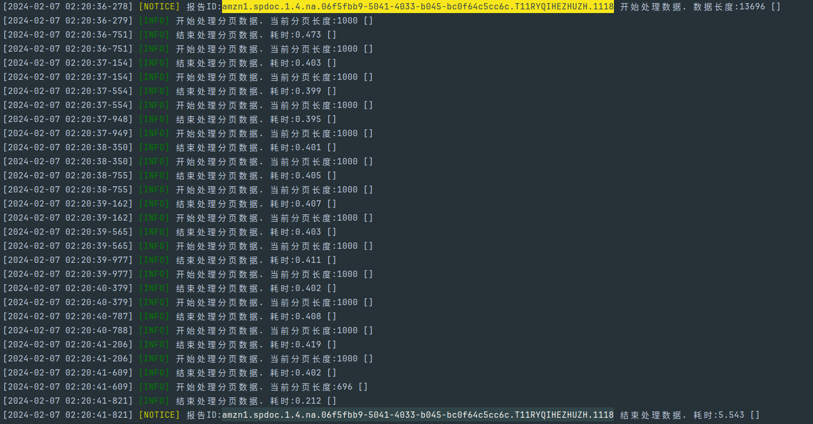
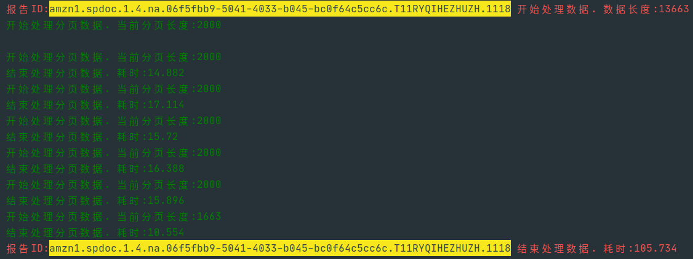
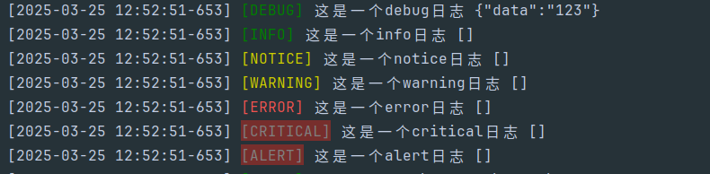

## hyperf-admin-amazon

#### 背景
> 此项目仅作为本人在公司项目对接SP-API开发过程中的经验总结归纳，包括经历过的项目中写的不错的代码，本人不保证此项目代码的正确性，请注意甄别。

#### 介绍
> 此项目基于PHP的Hyperf框架开发，需要你对Hyperf框架有一定的了解。

此项目主要代码在`app/Command` 下，
- Amazon  **文件夹存放对接SP-API 代码**
- Auto    **暂定存放创建Controller,Model,Service类文件的自定义命令**
- Crontab **文件夹存放定时任务命令**
- Fake    **文件夹存放手动触发某些动作去创建或构造某些结构，例如构造指定队列数据**
- Monitor **文件夹存放监控系统指定数据，例如监控队列长度等(考虑移动到Crontab文件夹内)**
- Schedule **文件夹存放周期任务(考虑移动到Crontab文件夹内)**

- ``app/Queue`` **存放队列类与队列Data类**
- ``app/Util``  **存放一些工具类与逻辑处理类**

本项目设计时考虑了多商户多店铺的情况，所以大部分表都需要有`merchant_id`与`merchant_store_id`字段。项目初始化时请把相应配置填入`amazon_app`表和`amazon_app_region`表中。

### 常用命令
```
# 刷新Token缓存

crontab:amazon:refresh-app-token

# 创建报告
### 强制创建销售与流量报告， 时间范围为2023-12-01到2023-12-20，循环创建每一天的报告
> php bin/hyperf.php amazon:report:create 1 1 GET_SALES_AND_TRAFFIC_REPORT --report_start_date=2023-12-01 --report_end_date=2023-12-20 --is_range_date=1 --is_force_create=1
# 拉取报告
> php bin/hyperf.php amazon:report:get
# 处理报告
> php bin/hyperf.php amazon:report:action

# 获取周期报告
> php bin/hyperf.php amazon:report:gets 1 1 us-east-1 GET_DATE_RANGE_FINANCIAL_TRANSACTION_DATA
# 拉取周期报告
> php bin/hyperf.php amazon:report:gets-document
# 处理周期报告
> php bin/hyperf.php amazon:report:action-document

```
[即时报告类型报告和周期报告定义](./config/autoload/amazon_reports.php)

##### 项目亮点

1. 性能对比

Hyperf框架与ThinkPHP5相同逻辑处理同一个报告，差距也太大了。Swoole真的强

但目前我没有实现常驻进程的平滑退出，这是我在这项目中困扰的点






2. 基于Redis List队列封装

以[拉取亚马逊周期报告队列](./app/Command/Amazon/Report/ReportGetDocument.php)为例

```php

//(new AmazonGetReportDocumentQueue())->pop();//单个请求拉取报告
(new AmazonGetReportDocumentQueue())->coPop(30);//并行拉取30个报告
```
[AmazonGetReportDocumentQueue](./app/Queue/AmazonGetReportDocumentQueue.php)继承[Queue](./app/Queue/Queue.php)类，**handleQueueData**方法为处理队列数据的方法。每个队列类都需要实现**handleQueueData**方法和定义队列名称即可。

Queue类封装了Redis List的常用操作，包括：
- 入队[push()](./app/Queue/Queue.php#L35)方法
- 出队单个消费[pop()](./app/Queue/Queue.php#L46)方法和并行消费[coPop()](./app/Queue/Queue.php#L130)方法。其中coPop()方法使用了协程来实现并行消费。（实测性能提升非常大）
- 获取队列长度[len()](./app/Queue/Queue.php#L227)方法


投递到队列中的数据需要是实现[QueueDataInterface](./app/Queue/Data/QueueDataInterface.php)接口的对象[AmazonReportDocumentActionData](./app/Queue/Data/AmazonReportDocumentActionData.php)
```php

    $amazonGetReportDocumentData = new AmazonGetReportDocumentData();
    $amazonGetReportDocumentData->setMerchantId($merchant_id);
    $amazonGetReportDocumentData->setMerchantStoreId($merchant_store_id);
    $amazonGetReportDocumentData->setRegion($region);
    $amazonGetReportDocumentData->setMarketplaceIds($report_marketplace_ids);
    $amazonGetReportDocumentData->setReportDocumentId($report_document_id);
    $amazonGetReportDocumentData->setReportType($report_type);

    $queue = new AmazonGetReportDocumentQueue();
    // 将同一报告类型 的文档id投递到队列，异步拉取报告
    $queue->push($amazonGetReportDocumentData);

```


3. 基于Redis Hash的封装

以[AmazonAccessTokenHash](./app/Util/RedisHash/AmazonAccessTokenHash.php)为例，继承[AbstractRedisHash](./app/Util/RedisHash/AbstractRedisHash.php)类，结合类的@proterty 属性，可以实现类访问属性的方式操作Redis Hash。
```php
        $hash = make(AmazonAccessTokenHash::class, ['merchant_id' => $this->getMerchantId(), 'merchant_store_id' => $this->getMerchantStoreId(), 'region' => $region]);

        $hash->token;
        $hash->refreshToken;
        $hash->type;
        $hash->expiresIn;
        $hash->grantType;
```

这样封装的好处是，可以非常方便的操作Redis Hash，避免了手动拼接Redis Key的麻烦。


4. 日志的封装

- 控制台日志：[ConsoleLog](./app/Util/ConsoleLog.php)。实际实现的日志类为[StdoutLogger](./app/Util/StdoutLogger.php)
    主要的目的是输出日志到控制台，并附带时间数据，方便调试。
    日志格式为：`[时间] [日志级别] [日志内容] [上下文数据]`
```php
    $console = ApplicationContext::getContainer()->get(ConsoleLog::class);

    $console->debug('这是一个debug日志',['data'=>'123']);
    $console->info('这是一个info日志');
    $console->notice('这是一个notice日志');
    $console->warning('这是一个warning日志');
    $console->error('这是一个error日志');
    $console->critical('这是一个critical日志');
    $console->alert('这是一个alert日志');
```



- 文件类日志
    > 文件类日志，默认会记录到`runtime/logs/`目录下，不同业务的文件夹下日志文件名以日期命名，如：`2025-01-01.log`

    以[AmazonFinanceLog](./app/Util/Log/AmazonFinanceLog.php)文件为例，继承[AbstractLog](./app/Util/Log/AbstractLog.php)类，同样提供标准的日志接口。
```php
    $log = ApplicationContext::getContainer()->get(AmazonFinanceLog::class);
    $log->debug('这是一个debug日志',['data'=>'123']);
    $log->info('这是一个info日志');

```

5. AmazonApp的封装

    [AmazonApp](./app/Util/AmazonApp.php)提供了tick(),tok(),tok2(),single(),each()等方法，其中

    ```php
        //tick() 需要传递merchant_id,merchant_store_id,callback函数这三个参数，匿名函数中回传的是AmazonAppModel对象

        AmazonApp::tick($merchant_id,$merchant_store_id,function(AmazonAppModel $amazonAppCollection){
            //用于指定商户ID+指定店铺ID 下的一些操作。
        });

    ```
    [tick()暂无参考例子]()
    ```php
        //tok() 需要传递merchant_id,merchant_store_id,callback函数这三个参数，匿名函数中回传的是AmazonSDK对象, $merchant_id商户ID, $merchant_store_id店铺ID, SellingPartnerSDK对象, AccessToken对象, $region当前地区, $marketplace_ids当前地区的站点ID集合。

        AmazonApp::tok($merchant_id,$merchant_store_id,function($merchant_id, $merchant_store_id, SellingPartnerSDK $spApi, AccessToken $accessToken, $region, $marketplace_ids){
            //用于指定商户ID+指定店铺ID下所有的所有地区的操作。
        });

        //例如，我需要请求刷新指定商户ID+指定店铺ID下所有地区的Pending状态订单，那么就可以使用这个方法。
    ```
    [tok()参考例子](./app/Command/Crontab/Amazon/RefreshPendingOrder.php#L62)

    ```php
        //tok2() 需要传递merchant_id,merchant_store_id,region,callback函数这四个参数，匿名函数中回传的是AmazonSDK对象, $merchant_id商户ID, $merchant_store_id店铺ID, SellingPartnerSDK对象, AccessToken对象, $region当前地区, $marketplace_ids当前地区的站点ID集合。

        AmazonApp::tok2($merchant_id, $merchant_store_id, $region, static function (AmazonSDK $amazonSDK, int $merchant_id, int $merchant_store_id, SellingPartnerSDK $sdk, AccessToken $accessToken, string $region, array $marketplace_ids) use ($amazon_order_ids) {
            //用于指定商户ID+指定店铺ID+指定地区下的操作。
        });

        //例如，我需要请求拉取指定商户ID+指定店铺ID+指定地区下某些订单的订单项数据
    ```
    [tok2()参考例子](./app/Command/Amazon/Order/GetOrderItems.php#L60)

    ```php
      //single() 和 tick()类似，但不需要指定**商户ID+指定店铺ID**，会遍历`amazon_app`表的数据并在callback匿名函数中传递AmazonAppModel对象。

      AmazonApp::tick(function(AmazonAppModel $amazonAppCollection){
            //执行当前商户ID+当前店铺ID 下的一些操作。
      });
    ```

    [single()参考例子](./app/Command/Crontab/Amazon/RefreshAppToken.php#L51)

    ```php
      //each() 和 tok() 类似，但不需要指定**商户ID+指定店铺ID**，会遍历`amazon_app`表和`amazon_app_region`表，会自动构建好有效AmazonSDK对象和AccessToken对象，并在callback匿名函数中传递AmazonSDK对象, $merchant_id商户ID, $merchant_store_id店铺ID, SellingPartnerSDK对象, AccessToken对象, $region当前地区, $marketplace_ids当前地区的站点ID集合

      AmazonApp::each(static function (AmazonSDK $amazonSDK, int $merchant_id, int $merchant_store_id, SellingPartnerSDK $sdk, AccessToken $accessToken, string $region, array $marketplace_ids) {
          //执行当前商户ID+当前店铺ID+当前地区 下请求SP-API操作
      });
    ```
    [each()参考例子](./app/Command/Crontab/Amazon/AmazonReportCreate.php#L55)


    亚马逊应用存在一个店铺存在多个地区(每个地区的refresh_token值不一样)的情况，结合实际开发过程中来看，会有以下场景：
    1. 定时任务执行某些以店铺维度划分的任务，不需要考虑地区和市场和不需要请求SP-API，可以使用single()方法
    2. 定时任务执行某些以店铺维度划分的任务，需要考虑地区和市场和需要请求SP-API，可以使用each()方法
    3. 定时任务执行已知商户ID+店铺ID，且亚马逊应用下所有的地区同时需要请求SP-API，可以使用tick()方法
    4. 定时任务执行已知商户ID+店铺ID+地区，同时需要请求SP-API，可以使用tok()方法
